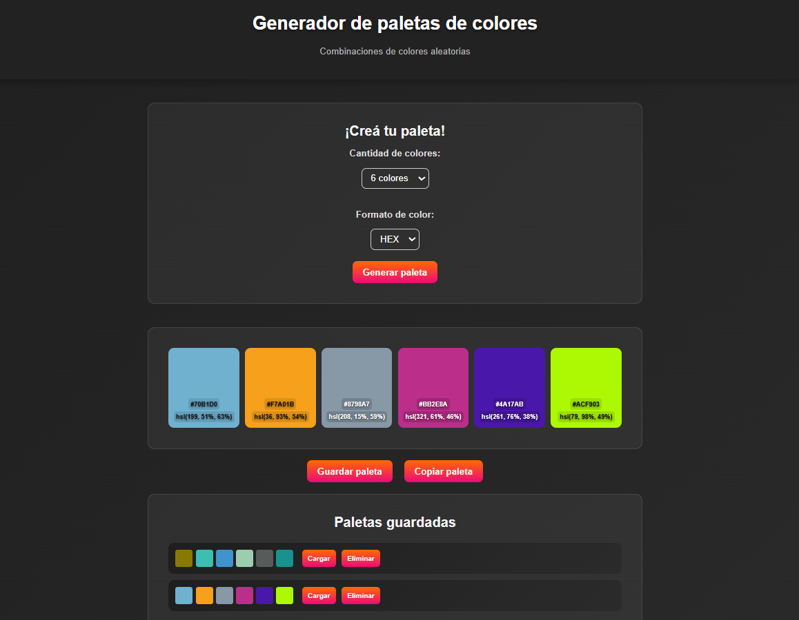

# 🎨 Generador de paletas de colores - ColorFly Studio

Aplicación web que permite generar paletas de colores aleatorias en formato HEX o HSL, con posibilidad de copiar, guardar y reutilizar paletas.

---

## 📸 Vista previa

Así se ve la aplicación en funcionamiento:



---


## 🚀 Funcionalidades

- Generación de paletas de colores aleatorias
- Selección de cantidad de colores (6, 8 o 9)
- Selección de formato (HEX o HSL)
- Visualización del código HEX y HSL de cada color
- Copiado individual de colores
- Copiado de la paleta completa
- Guardado de paletas en el navegador (localStorage)
- Carga y eliminación de paletas guardadas
- Feedback visual mediante notificaciones (toast)
- Indicaciones visuales para mejorar la interacción (hover, overlay)
- Adaptación automática del contraste del texto según el color

---

## 🛠️ Tecnologías utilizadas 

- HTML5 (estructura semántica)
- CSS3 (Flexbox, Grid, uso de rem para escabilidad)
- JavaScript (DOM, eventos, localStorage)
- Git y GitHub
- Github Pages (deploy)

---

## 📦 Cómo usar la aplicación

1. Seleccionar la cantidad de colores
2. Elegir el formato (HEX o HSL)
3. Hacer click en **"Generar paleta"**
4. Interactuar con los colores:
    - Click → copiar color
    - Hover → ver indicación
5. Guardar la paleta si se desea
6. Cargar o eliminar paletas guardadas

---

## 💻 Ejecución local 

1. Clonar el repositorio: 

```bash
git clone https://github.com/Nataliamicaela/ProyectoM1_NataliaAlvarez-.git
```
2. Abrir el archivo index.html en el navegador

---

## 🌐 Demo en vivo 

Podés ver la aplicación funcionando aquí:

https://nataliamicaela.github.io/ProyectoM1_NataliaAlvarez-/

> ⚡ El proyecto está desplegado usando GitHub Pages

---

## 🧠 Decisiones técnicas

- Se utilizó localStorage para persistir las paletas sin necesidad de backend
- Se separó la lógica en funciones para mejorar la legibilidad y mantenimiento
- Se priorizó el uso de rem para lograr un diseño más adaptable
- Se utilizaron clases dinámicas en lugar de estilos inline para mantener un CSS limpio
- Se implementó feedback visual (toast) para mejorar la experiencia del usuario
- Se aplicaron mejoras de accesibilidad como uso de aria-label y navegación por teclado

--- 


## 🤖 Uso de Inteligencia Artificial

Se utilizó IA como herramienta de apoyo para:

- Mejorar la estructura del código
- Implementar funcionalidades como:
- Toast notifications
- Copiado al portapapeles
- Manejo de localStorage
- Optimizar la experiencia de usuario (UX/UI)
- Resolver errores durante el desarrollo

Los prompts utilizados y sus resultados se encuentran documentados en la carpeta de Google Drive.

---

## 📁 Documentación adicional

Incluye:

- Capturas de pantalla / GIF del funcionamiento
- Documentación del uso de IA (prompts y resultados)

📌 Link de Drive:

---

## 👩‍💻 Autora

Natalia Alvarez
Proyecto realizado para ColorFly Studio